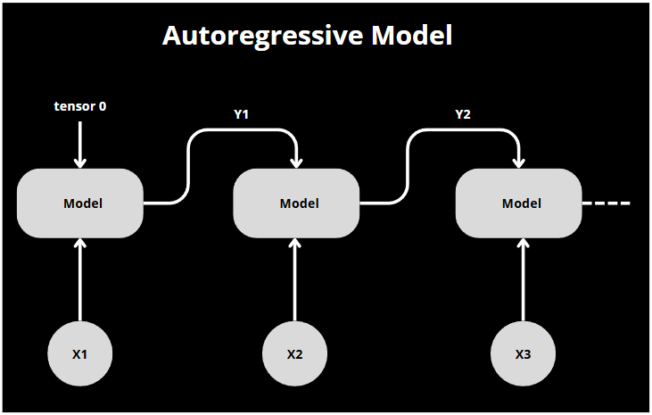
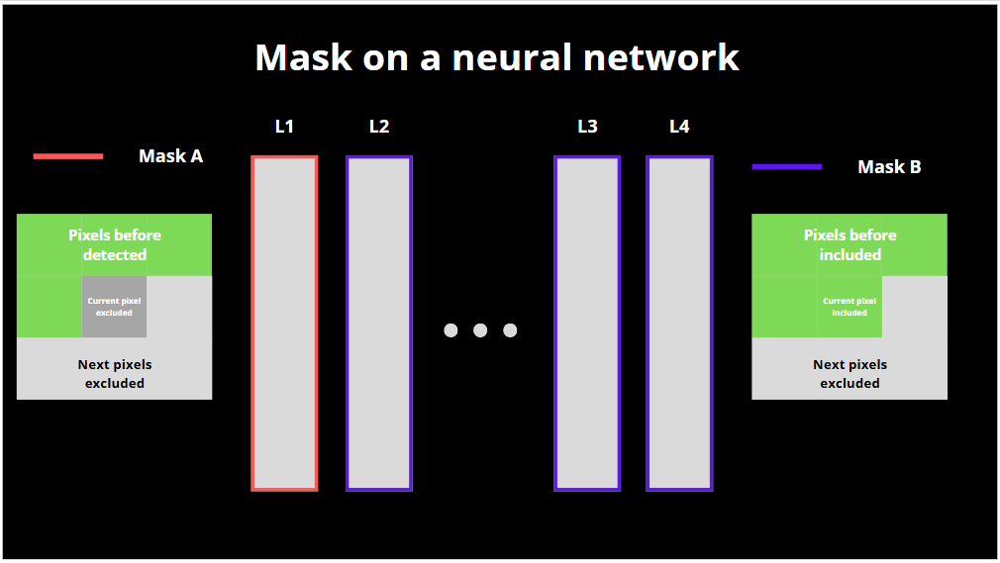
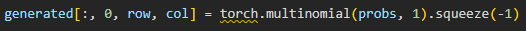

# Autoregressive Models (PixelCNN)

## Introduction

Dans ce TP nous allons expliquer en détails le fonctionnement du modèle PixelCNN à travers un code donné en exemple. Tout d’abord, définissons rapidement comment fonctionne un modèle autorégressif. Dans cette famille on en compte 4, le RNN, le LSTM, le GRU et enfin le transformer. Chacun a sa propre spécificité mais prenons pour base le RNN (Recurent neural network) afin de bien comprendre le fonctionnement des autorégressifs modèles. Le RNN est très utiles notamment pour la prédiction de petites séries temporelles. Pour le reste de l’explication nous prendrons pour exemple la prédiction du prix des patates. Le modèle prend deux paramètres en entrés. Les inputs nécessaires à la prédiction à l’instant T, par exemple, la quantité de patate produite, les intempéries ect…. Mais également la valeur réel ou prédite précédente de notre variable de prédiction, ici, le prix de notre patate. On précise, réel ou prédite car généralement on commence par données des valeurs réels pour initialiser notre modèle et par la suite on lui donne les valeurs qu’il vient de prédire. On se retrouve donc avec une boucle où le modèle utilise le résultat de sa précédente prédiction pour prédire la suivante. On voit bien le cheminement sur le schéma ci-dessous.

  Figure 1 : Schéma d’un model autorégressif classique type RNN

 

## Présentation de PixelCNN

Dans le code présent dans ce github nous étudions un modèle bien précis, le PixelCNN. Ce dernier est un type de modèle auto régressive centrée sur la génération d’images. Le but est de générer pixels par pixels, au même titre qu’une valeur de notre série temporelle pour le RNN. Pour ce faire nous devons nous assurer de respecter les règles des auto régressives modèles. Tout d’abord, il faut que chaque pixel créé ne prenne pas en compte uniquement le ou les pixels précédemment créés. C’est ce qu’on va appeler le masque de convolution. Ensuite, il faut faire face aux problèmes d’initialisation. En effet, si on utilise simplement 1 filtre à notre image, on donne donc, pour chaque première itération, un pixel réel au modèle. Dans notre cas, ça peut être problématique. Si on boucle plusieurs fois durant l’entraînement le modèle peut généraliser en apprenant l’image sur laquelle il s’entraîne à cause de l’initialisation. Cela aura comme conséquence de bon résultat en train et de mauvais en validation. Pour éviter cela, on divise en deux masques, A et B. Le masque A est pour l’initialisation, on ne prend ni en compte le pixel actuel (central), ni les suivants. Il est présent dans la première couche de notre modèle. Pour les autres couches on utilise le masque B qui prend en compte le pixel central et ceux passés. Il bloque uniquement la visibilité sur les pixels futurs non générés. Grâce à ses masques donnant accès ou non à certains pixels, on se retrouve avec un comportement similaire à une fenêtre glissante.

Figure 2 : Schema de la repartition des masques

 

On construit notre code de la façon suivante, on créer une classe qui représente nos convolutions classiques qu’on appellera le bloc résiduel. Ce dernier sera appelé dans notre classe PixelCNN dans laquelle on appelle les différentes couches associées à leurs masques. 

## Entrainement et évaluation

Une fois que tout est prêt, on peut passer à l’entraînement. On passe N fois sur chaque image de train et on fait travaille par batch de plusieurs images (comme par habitudes). On donne les images (passées en entier) au modèle CNN créé plus tôt et on obtient la distribution de probabilité de chaque pixel. On compare les sorties, on met à jour les poids et on calcul la loss. Regardons maintenant la génération avec l’évaluation.

Pour tester notre modèle PixelCNN nous utilisons le dataset fashionMNIST qui fournit des petites images pixelisées de vêtements. Pour évaluer notre modèle, on vient donc initialiser les tenseurs à 0, on met le modèle en mode évaluation et on commence par itérer sur chaque pixel à l’aide d’une double boucle imbriquée. Le modèle nous prédit la distribution des valeurs possibles qu’on transforme en probabilités. Enfin, on assigne la valeur choisie au pixel avec la ligne de code suivante.

Figure 3 : Ligne de code qui assigne la valeur du nouveau pixel dans l'évaluation (création de l'image)

 

J’ai décidé d’appuyer sur cette ligne car elle permet de choisir aléatoirement parmi les valeurs choisis par le modèle. Elle choisira l’indice de la valeur la plus présente la majorité du temps, mais il est possible qu’une autre valeur soit choisi. J’imagine c’est pour garder ce coté non déterministe et aléatoire comme bien souvent dans les modèles génératifs.

Finalement, avec un modèle entrainé, une trentaine de fois, nous avons des résultats qui commencent à etre satisfaisant. Néanmoins cette méthode n’est pas la plus efficace pour la génération d’images surtout lorsqu’on est limité en itérations.

## Conclusion

Pour conclure, PixelCNN est un bon modèle pour appréhender la génération d'images à l’aide de modèles auto régressive. En effet, l’exécution du modèle sur des images est plutôt visuel en itérant sur chaque pixel. De plus, l’utilisation de couches CNN rend la compréhension plus simple. Enfin, l’utilisation de masques dans le cadre des images est une notion très importante que met en valeur ce modèle. Je pense qu’on peut conclure d’après nos connaissances sur le modèle GPT que le modèle PixelCNN est moins performant que le GPT, car ce dernier utilise des transformers favorisant la compréhension sur le long terme.

